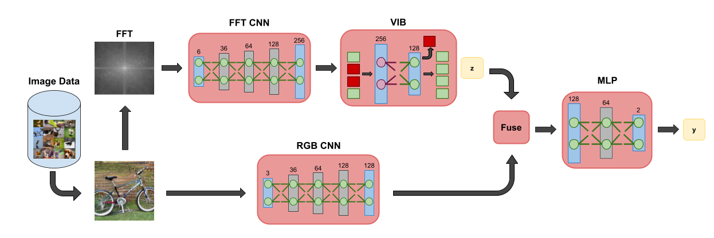
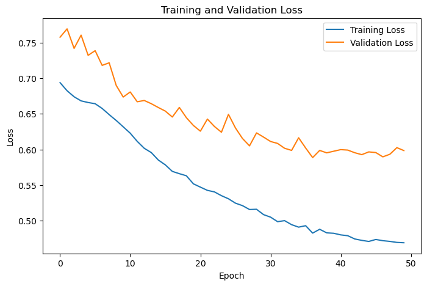
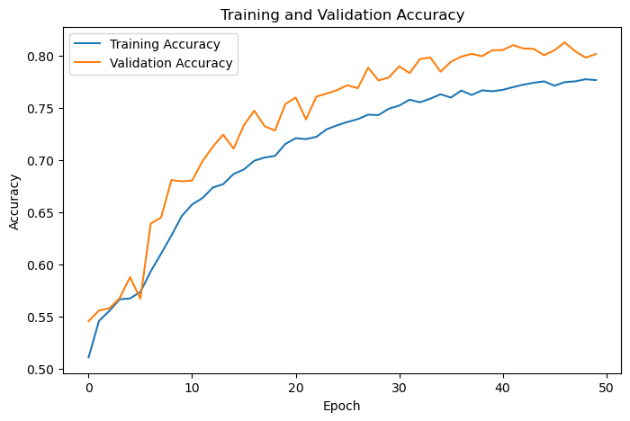

# FQBNeck: Detecting AI Images using Hybrid Approach of Frequency Analysis and Information Bottlenecks

This project aims to distinguish between real and AI-generated images using a multi-stream image classification framework that combines RGB spatial information and hidden frequency patterns revealed by FFT. This framework further leverages a variational information bottleneck to improve generalization across GANs and DM generated images.

**Author:** Isaac Gray **College:** Rochester Institute of Technology **Email:** ig8317@g.rit.edu

## Model Framework



*Figure 1: Overview of the FQBNeck framework*

## Requirements

* python = 3.10 
* numpy = 2.0.1 
* pyyaml = 6.0.3 
* torch = 2.5.1 
* torchvision = 0.20.1 
* pillow = 11.1.0 
* scikit-learn = 1.7.1 
* matplotlib = 3.10.8 
* pandas = 2.3.3
* pytorch-cuda = 12.1

## Install

1. Clone the repository and navigate to the FQBNeck folder
```
https://github.com/gray2729/FQBNeck
cd FQBNeck
```
2. Install requirements: Create conda  environment
```
conda create -n  FQBNeck_env python-3.10 -y
conda activate FQBNeck_env
pip install --upgrade pip
pip install -r requirements.txt
```

## Project Structure

```
FQBNeck/
    ├── datasets/         # Dataset storage
    │   ├── Hybrid/                 # Individual dataset
    |   |   ├── Training/
    |   |   ├── Validation/
    |   |   └── Testing/
    │   └── ...
    ├── figures/          # Images of datasets and results
    │   ├── dataset_distributions/  # Data distributions in dataset
    │   ├── dataset_samples/        # Image samples from dataset 
    │   ├── loss_curves/            # Training loss curves during Training
    │   └── ..
    ├── results/          # Testing Results
    │   ├── FQBNeck_Hybrid/         # Training/Testing results for individual model
    |   |   ├── config.yaml            # Config used for Training  
    |   |   ├── losses.csv             # Recorded losses during Training
    |   |   └── metrics.json           # Recorded metrics during Testing 
    │   └── ..
    ├── saved_models/     # Trained models
    │   ├── FQBNeck_Hybrid.pt       # Saved individual model
    │   └── ..
    ├── scripts/          # Scripts
    │   ├── configs/                # Configs for Training/Testing
    |   |   ├── configs.yaml
    |   |   └── ...
    │   ├── data/                   # Image data loading scripts
    │   ├── models/                 # Model architecture scripts
    │   ├── training/               # Training/Validation/Testing loop scripts
    │   └── utils/                  # Utility scripts
    ├── main.py           # Script for running Training/Testing loop
    ├── baselines.py      # Script for running baseline
    ├── requirements.txt  # Project requirements
    ├── README.md         # Project documentation
    └── LICENSE           # License 
```

## Usage

### Dataset

The Hybrid dataset used for this project was sampled from the ForenSynth and GenImage datasets and can be obtained from this [drive](https://drive.google.com/drive/u/3/folders/1nzhauhhMD-LWzZRUaG3Wbnsj8a7FBRVQ). 

To properly run the dataset, unzip and place the dataset within the datasets folder. If you want to run this project on your own datasets, make sure each dataset is formatted exactly as follows:

```
dataset
    ├── Training/
    |   ├── real/
    |   └── fake/
    ├── Validation/
    |   ├── real/
    |   └── fake/
    └── Testing/
        ├── real/
        └── fake/
```

To check if there are any corrupted/damaged files within the dataset which might cause issues when the images are loaded, run check_corruptions.py

```
cd scripts\utils
python check_corruptions --dataset Dataset_name
```

Replace Dataset_name with the name of the dataset folder you want to check.

Example:

``
python check_corruptions --dataset Hybrid
``

#### Data Visualization

To produce visualizations of the dataset, run image_visualizations.py

```
cd scripts\utils
python data_visualizations --dataset Dataset_name --visualization plot_type
```
Replace Datset_name with the name of the dataset folder you want to produce the plots for and plot_type with either **Distribution** or **Sample** to produce a plot of that type.

Example:

```
python data_visualizations --dataset Hybrid --visualization Distribution
```

This will produce a sample/Distribution plot, which will be saved in the figures folder.

### Configs

This project requires there to be a config.yaml file in the configs folder for image loading and the training process. The config.yaml file should contain **batch_size**, **image_size**, **num_workers**, **epochs**, **lr**, and **beta**.

 Example:

```
batch_size: 32      
image_size: 224
num_workers: 4
epochs: 50
lr: 0.001
beta: 0.00001
```

### Training

**Direct Python Training Command:**

```
python main.py --dataset Dataset_name --config Configs_name --process training --model_name Model_name
```

To train, run main.py with the training argument. Replace Dataset_name with name of the dataset folder you want to train the model on, Configs_name with the name of the config file, and Model_name with the name that you want to save the model under. 

Example:

```
python main.py --dataset Hybrid --config configs --process training --model_name fqbneck_hybrid
```

This will training a model and evaluate it afterwards, saving the model in the saved_models folder and the losses and metrics in the results folder. It will also save a copy of the configs used to train the model.

#### Loss Visualizations

To produce the loss/accuracy plots for training, run loss_visualizations.py.

```
cd scripts\utils
python loss_visualizations --model Model_name --visualization plot_type
``` 

Replace Model_name with the name of the model you want to produce the plots for and plot_type with either **Loss** or **Accuracy** to produce a plot of that type.

Example:

```
python loss_visualizations --model fqbneck_hybrid --visualization Loss
```

This will produce a loss/accuracy plot, which will be saved in the figures folder.

### Testing

**Direct Python Testing Command:**

```
python main.py --dataset Dataset_name --config Configs_name --process testing --model_name Model_name
```

To test, run main.py with the training argument. Replace Dataset_name with name of the dataset folder you want to evaluate the model with, Configs_name with the name of the config file, and Model_name with the name of the model that you want to evaluate. 

Example:

```
python main.py --dataset Hybrid --config configs --process testing --model_name fqbneck_hybrid
```

This will evaluate the model, saving the metrics in the results folder.

### Baselines

To run the baselines used in this project, run baselines.py

```
python baseline.py --dataset dataset_path --model model_type
```

Replace dataset_path with the path to the dataset folder you want to train the model on and replace model_type with **majority**, **logreg_rgb**, **logref_fft**, **resnet_rgb**, **resnet_fft**, or **resnet_rgb_fft**.

Example:
```
python baseline.py --dataset datasets\Hybrid --model resnet_fft
```

This will train and validate a model of the given type on the given dataset, printing the metrics out in the terminal. 

## Demo

Run main.py script with the following command-line arguments to train a model on the specific demo dataset (Hybrid_Sample) using the demo configs (sample_configs):
```
python main.py --dataset Hybrid_Sample --config sample_configs --process training --model_name fbqneck_demo
``` 

This will train a model for a specified number of epochs listed in the configs before testing the model.

Likewise, run main.py script with the following command-line arguments to test a model (FQBNeck) on a specific demo dataset (Hybrid_Sample) using the demo configs (sample_configs):

```
python main.py --dataset Hybrid_Sample --config sample_configs --process testing --model_name fqbneck_hybrid
```

This will print the metrics out in the terminal as well as save the metrics as metrics.json in results folder.

You can test any model trained by replacing the model name in the command-line arguments above with the desired model. Note that the desired model has to be in the saved_dataset folder. For example, to test model trained for the demo, replace fqbneck_hybrid above with fbqneck_demo as such:

```
python main.py --dataset Hybrid_Sample --config sample_configs --process testing --model_name fbqneck_demo
```

## Results and Visualization

### Loss Curve



*Figure 2: Training loss curve when FQBNeck was trained for 50 epochs on the Hybrid dataset*

### Accuracy Curve



*Figure 3: Accuracy curve when FQBNeck was trained for 50 epochs on the Hybrid dataset*

### Results

**Accuracy of Baselines and FBQNeck**

| Dataset  | Majority | LogReg | LogReg + FFT | ResNet | ResNet + FFT | FQBNeck (ForenSynth) | FQBNeck (GenImage) | FQBNeck (Hybrid) | 
|:------------- |:-------------:|:-------------:|:-------------:|:-------------:|:-------------:|:-------------:|:-------------:|:-------------:|
| ForenSynth      | 0.500 | 0.675 | 0.707 | 0.863 | 0.835 | 0.746 | 0.534 | 0.734 
| GenImage        | 0.500 | 0.775 | 0.794 | 0.934 | 0.904 | 0.464 | 0.875 | 0.789
| Hybrid          | 0.500 | 0.657 | 0.690 | 0.831 | 0.791 | 0.700 | 0.607 | 0.756

*Table 1: Accuracy of each baseline method and our method when evaluated on each dataset. For FQBNeck, we trained it on the dataset within the parentheses.*

**Average Precision of Baselines and FQBNeck**

| Dataset  | Majority | LogReg | LogReg + FFT | ResNet | ResNet + FFT | FQBNeck (ForenSynth) | FQBNeck (GenImage) | FQBNeck (Hybrid) | 
|:------------- |:-------------:|:-------------:|:-------------:|:-------------:|:-------------:|:-------------:|:-------------:|:-------------:|
| ForenSynth      | 0.499 | 0.718 | 0.754 | 0.927 | 0.926 | 0.748 | 0.558 | 0.785
| GenImage        | 0.450 | 0.851 | 0.866 | 0.983 | 0.970 | 0.471 | 0.959 | 0.886
| Hybrid          | 0.500 | 0.714 | 0.713 | 0.915 | 0.875 | 0.700 | 0.684 | 0.828

*Table 2: Average precision of each baseline method and our method when evaluated on each dataset. For FQBNeck, we again trained it on the dataset within the parentheses.*
## Citation

If you use this code in your research, please cite:

```
@article{
    gray,
    title="FQBNeck: Detecting AI Images using Hybrid Approach of Frequency Analysis and Information Bottlenecks",
    author="Isaac Gray",
    institution="Rochester Institute of Technology",
    year="2026"
}
```

## Acknowledgments

This project used the ForenSynth dataset by Wang et al. and the GenImage dataset by Zhu et al to create the Hybrid dataset. The ForenSynth dataset was obtained [here](https://github.com/peterwang512/CNNDetection?tab=readme-ov-file) and the GenImage dataset was obtained [here](https://github.com/GenImage-Dataset/GenImage)

Below is the citation to their works:

```
@inproceedings{wang2019cnngenerated,
  title={CNN-generated images are surprisingly easy to spot...for now},
  author={Wang, Sheng-Yu and Wang, Oliver and Zhang, Richard and Owens, Andrew and Efros, Alexei A},
  booktitle={CVPR},
  year={2020}
}

@misc{zhu2023genimage,
      title={GenImage: A Million-Scale Benchmark for Detecting AI-Generated Image}, 
      author={Mingjian Zhu and Hanting Chen and Qiangyu Yan and Xudong Huang and Guanyu Lin and Wei Li and Zhijun Tu and Hailin Hu and Jie Hu and Yunhe Wang},
      year={2023},
      eprint={2306.08571},
      archivePrefix={arXiv},
      primaryClass={cs.CV}
}
```

## License

This project is licensed under the MIT License - see the [LICENSE](https://github.com/gray2729/FQBNeck/blob/main/LICENSE) file for details.